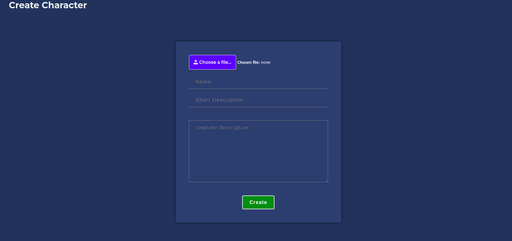

# Project ESCAPIUM
## Table of contents

- [Project ESCAPIUM](#project-escapium)
  - [Table of contents](#table-of-contents)
  - [Overview](#overview)
    - [The challenge](#the-challenge)
    - [Screenshot](#screenshot)
    - [Links](#links)
  - [Our process](#our-process)
    - [Built with](#built-with)
  - [Author](#author)

## Overview

### The challenge

Create a site with JS where we had to create characters, edit characters, delete characters and display them only once click on them while using an API and JS.

We had to:

- Be as semantic as possible
- Use the seven-to-one method
- SASS or other
- JavaScript
- Git
- Use API requests
- use a bundler

### Screenshot

Here's a little preview

### Links

[Project](https://aquamarine-entremet-40173a.netlify.app)

## Our process

### Built with

- Semantic HTML5 markup
- SASS
- Flexbox
- Grid
- Seven to one method
- GIT
- JavaScript
- Use of API requests
- Webpack

## Author

- J0K3RY-03 [PROFILE](https://github.com/J0K3RY-03)

- Nicolas [PROFILE](https://github.com/Nicolas1206)